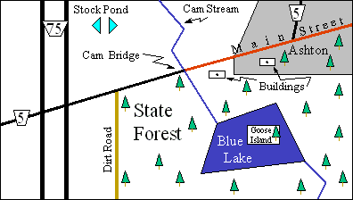
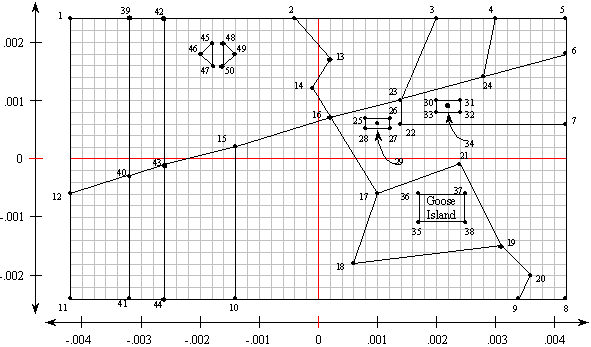
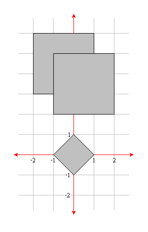

# Overview

This test suite is based on the following OGC specification:

  * _Web Map Server Implementation Specification_, version 1.3.0 [OGC 06-042] ( [PDF version](http://portal.opengeospatial.org/files/?artifact_id=14416)) 

## What is tested

  * **All implementations**
    * Dataset independent GetCapabilities, GetMap, and GetFeatureInfo requests, as derived from the capabilities.
  * **Basic conformance option**
    * Adds dataset specific GetMap requests. This option is required for certification.
  * **Queryable option**
    * Adds dataset specific GetFeatureInfo requests.
  * **Raster ELEVATION option**
    * Adds requests involving the ELEVATION dimension over a specific raster terrain dataset.
  * **Vector ELEVATION option**
    * Adds requests involving the ELEVATION dimension over a specific vector dataset representing features at various elevations.
  * **TIME option**
    * Adds requests involving the TIME dimension over a specific temporal dataset.
  * **Recomendations option**
    * Tests functionality which is recommended in the specification.

## What is not tested

  * Custom dimensions
  * "Automatic" coordinate reference systems (in the AUTO2 namespace)

## Test requirements

To ensure all of the tests in the test suite produce correct results, WMS
implementations must meet the following requirements:

  * **Basic conformance option (Required for certification)**
    * Must support image/png or image/gif for GetMap requests.
    * Must contain the test dataset in layers that are subsetable and resizable and support CRS:84.
    * The CRS:84 support must be precise up to the ten-thousandth of a degree.
    * The default style for the cite:Lakes layer must fill in the polygon with non-white pixels.
    * Servers that don't advertise a maximum image size must be able to generate maps as large as 1024x768. All servers must be able to generate maps as small as 8x5.
  

  * **Queryable option**
    * GetFeatureInfo requests must be supported.
    * Must contain the test dataset in layers that are subsetable and resizable and support CRS:84.
    * The polygon layers in the test dataset must be queryable.
  

  * **Raster ELEVATION option**
    * Must contain the cite:Terrain layer. The layer must declare support the elevation dimension as follows: 
        
                <Dimension name="elevation" units="CRS:88" unitSymbol="m" multipleValues="true" nearestValue="false"/>0/425/1</Dimension>

It may also set a default value.

  

  * **Vector ELEVATION option**
    * Must contain the cite:Lakes layer, which must support all three elevations. The layer must declare support the elevation dimension as follows: 
        
                <Dimension name="elevation" units="CRS:88" unitSymbol="m" default="500" multipleValues="false" nearestValue="true"/>500,490,480</Dimension>

  * **TIME option**
    * Must contain the cite:Autos layer. The layer must declare support the elevation dimension as follows: 
        
                <Dimension name="time" units="ISO8601" multipleValues="true" nearestValue="true"/>2000-01-01T00:00:00Z/2000-01-01T00:01:00Z/PT5S</Dimension>

It may also set a default value and/or set current="true".

Warning: There are currently slight differences
between the schema listed in Annex E.1 and the on-line version Annex E.1
refers to. This test suite uses the on-line version.

## Test Dataset Description

[Download the test dataset](data-wms-1.3.0.zip)

The majority of the dataset is based on the [ Conformance Test Guidelines for
OpenGIS Simple Features Specification for SQL, Revision 1.0
](http://portal.opengeospatial.org/files/?artifact_id=7587&version=2). This
set of features makes up a map of a fictional location called Blue Lake. The
features are as described in the Simple Features Specification for SQL
document, except they have been converted to WGS84 coordinates and have been
reoriented so the area is centered at 0 degrees latitude, 0 degrees longitude.
Figure 1 shows an overview map of the area with the prominent features
labeled. Figure 2 shows the location of each of the data points.

Figure 1: Overview of Blue Lake vicinity features

Figure 2: Blue Lake vicinity data points

Additional features have also been defined to test data at a smaller scale.
These consist of a diamond and two overlapping squares, as shown in figure 3.
It does not matter which square appears on top.  

Figure 3: Basic Polygon Features

More features have also been defined to test dimensional data. To support
testing the elevation dimension using terrain coverage data, a terrain dataset
derived from DTED data has been defined. It has values that range from 0 to
425m that include a "high spot" with values > 325m and a "low spot" with
values < 200m. The remainder of the dataset is filled with values between 200m
and 325m, including a few values that are exactly 250m. It covers a one degree
square area, centered at 0,0. To support testing the elevation dimension using
vector data, additional polygons representing the edge of the lake at other
depths have been defined. To support testing the time dimension, point
geometries that represent the locations of automobiles along the roads at 5
second increments during a one minute interval have been defined.  
  
The features are organized into layers as shown in table below. The layers may
be named in any fashion, but must be titled exactly as shown in the table.  

Layer titles and features

 <table border="1">
        <caption align="bottom">Layer titles and features</caption>
        <tr><td valign="top"><b>Layer Title</b></td><td valign="top"><b>Type</b></td>
            <td><b>Features Contained</b></td></tr>
        <tr><td valign="top">cite:Autos</td><td valign="top">point</td>
            <td>Contains point features representing automobiles along the roads.  Required only for the time option.</td></tr>
        <tr><td valign="top">cite:BasicPolygons</td><td valign="top">polygon</td>
            <td>Contains all the features shown in figure 3.</td></tr>
        <tr><td valign="top">cite:Bridges</td><td valign="top">point</td>
            <td>Contains Cam Bridge.</td></tr>
        <tr><td valign="top">cite:Buildings</td><td valign="top">polygon</td>
            <td>Contains the two buildings along Main Street.</td></tr>
        <tr><td valign="top">cite:DividedRoutes</td><td valign="top">line</td>
            <td>Contains both lanes of Route 75.</td></tr>
        <tr><td valign="top">cite:Forests</td><td valign="top">polygon</td>
            <td>Contains the State Forest polygon.</td></tr>
        <tr><td valign="top">cite:Lakes</td><td valign="top">polygon</td>
            <td>Contains Blue Lake.  For the vector elevation option, it also contains polygons representing the edge of the lake at other depths.</td></tr>
        <tr><td valign="top">cite:MapNeatline</td><td valign="top">line</td>
            <td>Contains the border surrounding the Blue Lake vicinity.</td></tr>
        <tr><td valign="top">cite:NamedPlaces</td><td valign="top">polygon</td>
            <td>Contains Ashton and Goose Island.</td></tr>
        <tr><td valign="top">cite:Ponds</td><td valign="top">polygon</td>
            <td>Contains both pools of Stock Pond.</td></tr>
        <tr><td valign="top">cite:RoadSegments</td><td valign="top">line</td>
            <td>Contains all the sections of Route 5, Main Street, and the dirt road.</td></tr>
        <tr><td valign="top">cite:Streams</td><td valign="top">line</td>
            <td>Contains Cam Stream and the unnamed stream south of Blue Lake.</td></tr>
        <tr><td valign="top">cite:Terrain</td><td valign="top">raster</td>
            <td>Contains raster terrain data.  Required only for the raster elevation option.</td></tr>
</table>

Metadata for each of these layers is supplied as XML files that adhere to the
[ISO 19139 schemas](http://standards.iso.org/ittf/PubliclyAvailableStandards/I
SO_19139_Schemas/).

## Abstract Test Suite

Detailed information about each of the tests can be found in the [abstract
test suite](wms-1_3_0-ats.html), which follows the ISO 19105 model.

## Release Notes

Release notes are available from the [relnotes.txt](relnotes.txt).

